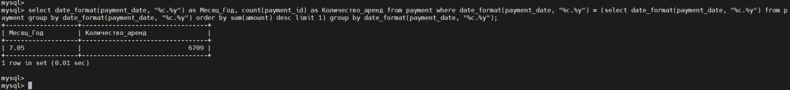

Домашнее задание к занятию "SQL. Часть 2" - <Бычков Денис Вячеславович>

Задание можно выполнить как в любом IDE, так и в командной строке.

Задание 1
Одним запросом получите информацию о магазине, в котором обслуживается более 300 покупателей, и выведите в результат следующую информацию:
фамилия и имя сотрудника из этого магазина;
город нахождения магазина;
количество пользователей, закреплённых в этом магазине.

select concat(sta.last_name, ' ', sta.first_name) as ФИО_сотрудника_магазина, ci.city as Город_нахождения_магазина, count(cu.store_id) as Количество_пользователей_магазина
from customer cu
join store sto on sto.store_id = cu.store_id
join staff sta on sta.store_id = sto.store_id
join address a on a.address_id = sto.address_id
join city ci on a.city_id = ci.city_id
group by cu.store_id, sta.staff_id, a.address_id, ci.city_id
having count(cu.store_id) > 300;

Задание 2
Получите количество фильмов, продолжительность которых больше средней продолжительности всех фильмов.

select count(film_id)
from film
where length > (select avg(length) from film);

Задание 3
Получите информацию, за какой месяц была получена наибольшая сумма платежей, и добавьте информацию по количеству аренд за этот месяц.

select date_format(payment_date, "%c.%y") as Месяц_Год, count(payment_id) as Количество_аренд
from payment
where date_format(payment_date, "%c.%y") = (select date_format(payment_date, "%c.%y") from payment group by date_format(payment_date, "%c.%y") order by sum(amount) desc limit 1)
group by date_format(payment_date, "%c.%y");

